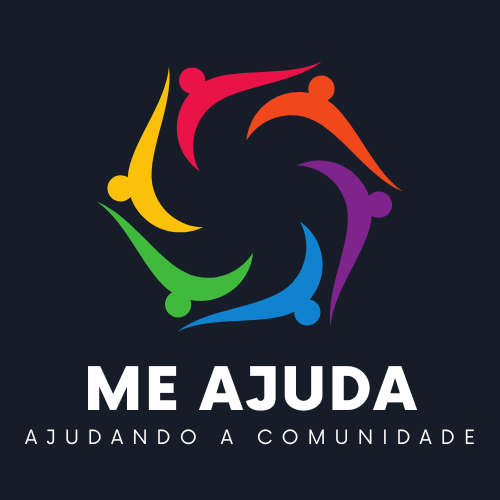

    

## Sobre

O projeto MeAjuda tem como objetivo conectar pessoas que precisam de ajuda com aquelas que estão dispostas a ajudar. Os usuários podem publicar anúncios solicitando ajuda em diversas áreas, como móveis, serviços, alimentação e dinheiro. Da mesma forma, eles podem oferecer algo que desejam doar ou fornecer como forma de assistência.

## Licença

O projeto MeAjuda é de uso livre, podendo ser utilizado para qualquer finalidade.
